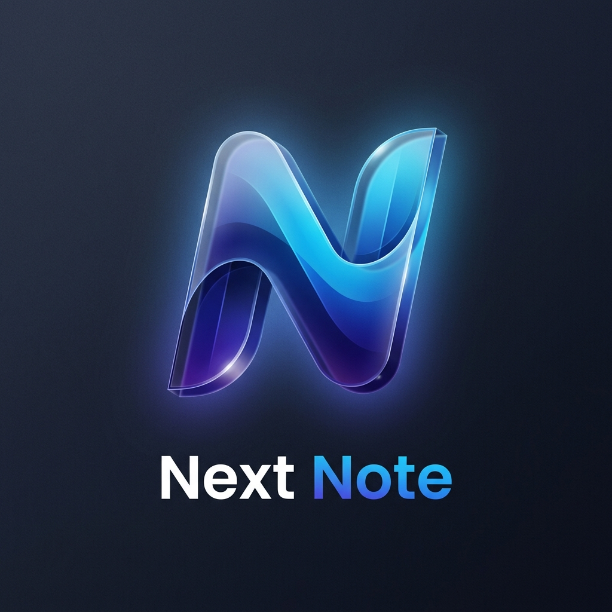

# Next Note

<div align="center">
  
  <h2>Premium Developer Notes</h2>
  <p>A high-performance, keyboard-first note-taking system built with Next.js 15, Firebase, and Tailwind CSS 4.0.</p>
</div>

---

**Next Note** is a best-in-class, developer-centric workspace designed for maximum productivity. Inspired by the sleek aesthetics of Linear and the powerful organization of Notion, it provides a seamless experience for capturing thoughts, managing tasks, and building your personal knowledge base.

## ✨ Features

- **🚀 Firebase Authentication**: Complete auth suite supporting:
  - Email/Password
  - **Phone OTP verification**
  - Continuous **Guest Access**
  - Social Logins (Google, GitHub, Facebook)
- **📝 Advanced Block Editor**: Powered by TipTap, supporting markdown, tasks, and high-fidelity code blocks.
- **🎨 Premium Interface**: A dynamic, glassmorphic design system using **Hero UI** and **Framer Motion**.
- **⌨️ Keyboard First**: Global command palette (⌘K) for rapid navigation and action execution.
- **📱 Responsive Layout**: A dual-navigation system featuring a sleek Sidebar and a new premium Navbar.

## 🛠️ Tech Stack

- **Framework**: [Next.js 15](https://nextjs.org/) (App Router, Server Components)
- **Auth**: [Firebase](https://firebase.google.com/) (Auth, Analytics)
- **UI Components**: [Hero UI](https://heroui.com/) (formerly NextUI)
- **Styling**: [Tailwind CSS 4.0](https://tailwindcss.com/)
- **Icons**: [Lucide React](https://lucide.dev/)
- **Animations**: [Framer Motion](https://www.framer.com/motion/)

## 📦 Getting Started

### 1. Clone & Install
```bash
git clone https://github.com/ahadunnobi/next-note.git
cd next-note
npm install
```

### 2. Environment Variables
Create a `.env.local` file in the root directory and add your Firebase credentials:
```env
NEXT_PUBLIC_FIREBASE_API_KEY=YOUR_API_KEY
NEXT_PUBLIC_FIREBASE_AUTH_DOMAIN=YOUR_AUTH_DOMAIN
NEXT_PUBLIC_FIREBASE_PROJECT_ID=YOUR_PROJECT_ID
NEXT_PUBLIC_FIREBASE_STORAGE_BUCKET=YOUR_STORAGE_BUCKET
NEXT_PUBLIC_FIREBASE_MESSAGING_SENDER_ID=YOUR_MESSAGING_SENDER_ID
NEXT_PUBLIC_FIREBASE_APP_ID=YOUR_APP_ID
```

### 3. Run Locally
```bash
npm run dev
```

## 🎨 Design Philosophy

Next Note prioritizes **visual excellence** and **interaction density**. Every element—from the HSL-based dark mode to the subtle micro-animations—is crafted to provide a premium feel that wows the user from the first click.

---

<p align="center">Made with ❤️ for Developers</p>
